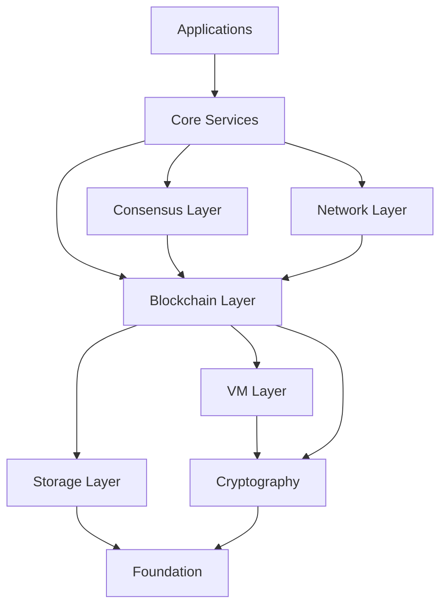

# Neo C++ Development Guide

## Overview

This guide provides comprehensive information for developers working on the Neo C++ blockchain node, including coding standards, development workflows, testing procedures, and contribution guidelines.

## Development Environment Setup

### Prerequisites
- **C++ Compiler**: GCC 11+ or Clang 13+ with C++20 support
- **CMake**: Version 3.20 or higher
- **Git**: Latest version
- **IDE**: VS Code, CLion, or Visual Studio 2022

### Required Tools
```bash
# Ubuntu/Debian
sudo apt install -y \
    build-essential \
    cmake \
    git \
    gdb \
    valgrind \
    clang-format \
    clang-tidy \
    cppcheck \
    doxygen \
    graphviz

# Install vcpkg
git clone https://github.com/Microsoft/vcpkg.git
cd vcpkg
./bootstrap-vcpkg.sh
```

### IDE Configuration

#### VS Code Setup
```json
// .vscode/settings.json
{
    "C_Cpp.default.cppStandard": "c++20",
    "C_Cpp.default.configurationProvider": "ms-vscode.cmake-tools",
    "cmake.configureArgs": [
        "-DCMAKE_TOOLCHAIN_FILE=${workspaceFolder}/vcpkg/scripts/buildsystems/vcpkg.cmake",
        "-DCMAKE_BUILD_TYPE=Debug",
        "-DBUILD_TESTS=ON"
    ],
    "files.associations": {
        "*.h": "cpp",
        "*.hpp": "cpp"
    }
}
```

#### CLion Configuration
```cmake
# CMakeSettings.json for CLion
{
    "configurations": [
        {
            "name": "Debug",
            "configurationType": "Debug",
            "buildRoot": "${projectDir}\\build\\debug",
            "cmakeCommandArgs": "-DCMAKE_TOOLCHAIN_FILE=${projectDir}/vcpkg/scripts/buildsystems/vcpkg.cmake",
            "buildCommandArgs": "-j $(nproc)",
            "variables": [
                {
                    "name": "BUILD_TESTS",
                    "value": "ON"
                }
            ]
        }
    ]
}
```

## Project Structure

### Directory Layout
```
neo_cpp/
├── apps/                    # Application entry points
│   ├── cli/                # Command-line interface
│   └── gui/                # Graphical user interface
├── include/                # Public header files
│   └── neo/               # Neo-specific headers
├── src/                   # Source implementation
│   ├── cli/               # CLI-specific code
│   ├── consensus/         # dBFT consensus
│   ├── cryptography/      # Cryptographic functions
│   ├── ledger/           # Blockchain ledger
│   ├── network/          # P2P networking
│   ├── smartcontract/    # Smart contract execution
│   └── vm/               # Virtual machine
├── tests/                # Test suites
│   ├── unit/             # Unit tests
│   ├── integration/      # Integration tests
│   └── performance/      # Performance tests
├── docs/                 # Documentation
├── scripts/              # Build and deployment scripts
├── examples/             # Example applications
└── tools/                # Development tools
```

### Module Dependencies


## Coding Standards

### C++ Style Guide

#### Naming Conventions
```cpp
// Classes: PascalCase
class BlockchainManager {
public:
    // Methods: PascalCase
    bool ProcessBlock(std::shared_ptr<Block> block);
    
    // Private members: trailing underscore
private:
    std::shared_ptr<IStore> store_;
    uint32_t blockHeight_;
};

// Constants: UPPER_SNAKE_CASE
constexpr uint32_t MAX_BLOCK_SIZE = 1048576;

// Enums: PascalCase with scoped enum
enum class TransactionType : uint8_t {
    MinerTransaction = 0x00,
    IssueTransaction = 0x01,
    ClaimTransaction = 0x02
};

// Namespaces: lowercase
namespace neo::ledger {
    // Implementation
}
```

#### Header File Template
```cpp
// include/neo/ledger/blockchain.h
#pragma once

#include <memory>
#include <vector>
#include <functional>

#include "neo/common/types.h"
#include "neo/persistence/istore.h"

namespace neo::ledger {

/**
 * @brief Main blockchain management class
 * 
 * The Blockchain class is responsible for managing the blockchain state,
 * processing new blocks, and maintaining the ledger integrity.
 * 
 * @example
 * @code
 * auto blockchain = std::make_shared<Blockchain>(settings, store);
 * if (blockchain->Initialize()) {
 *     auto block = blockchain->GetCurrentBlock();
 * }
 * @endcode
 */
class Blockchain {
public:
    /**
     * @brief Constructor
     * @param settings Protocol settings
     * @param store Storage backend
     */
    Blockchain(std::shared_ptr<ProtocolSettings> settings,
               std::shared_ptr<IStore> store);
    
    /**
     * @brief Destructor
     */
    ~Blockchain();
    
    // Disable copy constructor and assignment
    Blockchain(const Blockchain&) = delete;
    Blockchain& operator=(const Blockchain&) = delete;
    
    // Enable move constructor and assignment
    Blockchain(Blockchain&&) = default;
    Blockchain& operator=(Blockchain&&) = default;
    
    /**
     * @brief Initialize the blockchain
     * @return true if successful, false otherwise
     */
    bool Initialize();
    
private:
    std::shared_ptr<ProtocolSettings> settings_;
    std::shared_ptr<IStore> store_;
    mutable std::shared_mutex mutex_;
};

} // namespace neo::ledger
```

#### Implementation File Template
```cpp
// src/ledger/blockchain.cpp
#include "neo/ledger/blockchain.h"

#include <algorithm>
#include <stdexcept>

#include "neo/common/logger.h"
#include "neo/ledger/block.h"

namespace neo::ledger {

Blockchain::Blockchain(std::shared_ptr<ProtocolSettings> settings,
                       std::shared_ptr<IStore> store)
    : settings_(std::move(settings))
    , store_(std::move(store)) {
    if (!settings_) {
        throw std::invalid_argument("Settings cannot be null");
    }
    if (!store_) {
        throw std::invalid_argument("Store cannot be null");
    }
}

Blockchain::~Blockchain() = default;

bool Blockchain::Initialize() {
    std::unique_lock lock(mutex_);
    
    try {
        // Initialize blockchain from storage
        // Implementation details...
        
        LOG_INFO("Blockchain initialized successfully");
        return true;
    } catch (const std::exception& e) {
        LOG_ERROR("Failed to initialize blockchain: {}", e.what());
        return false;
    }
}

} // namespace neo::ledger
```

### Code Formatting
```bash
# .clang-format
BasedOnStyle: Google
IndentWidth: 4
TabWidth: 4
UseTab: Never
ColumnLimit: 100
AccessModifierOffset: -4
NamespaceIndentation: None
BreakBeforeBraces: Attach
AllowShortFunctionsOnASingleLine: Empty
AlignConsecutiveAssignments: true
AlignConsecutiveDeclarations: true
```

### Static Analysis Configuration
```yaml
# .clang-tidy
Checks: >
  *,
  -fuchsia-*,
  -google-build-using-namespace,
  -google-readability-todo,
  -llvm-header-guard,
  -modernize-use-trailing-return-type,
  -readability-named-parameter

CheckOptions:
  - key: readability-identifier-naming.ClassCase
    value: CamelCase
  - key: readability-identifier-naming.FunctionCase
    value: CamelCase
  - key: readability-identifier-naming.VariableCase
    value: camelBack
  - key: readability-identifier-naming.PrivateMemberSuffix
    value: "_"
```

## Development Workflow

### Git Workflow
```bash
# 1. Create feature branch
git checkout -b feature/new-consensus-algorithm

# 2. Make changes and commit
git add .
git commit -m "Add new consensus algorithm implementation

- Implement enhanced dBFT algorithm
- Add unit tests for consensus logic
- Update documentation"

# 3. Run tests before pushing
cmake --build build --target test

# 4. Push and create pull request
git push origin feature/new-consensus-algorithm
```

### Commit Message Format
```
<type>(<scope>): <subject>

<body>

<footer>
```

**Types:**
- `feat`: New feature
- `fix`: Bug fix
- `docs`: Documentation changes
- `style`: Code style changes
- `refactor`: Code refactoring
- `test`: Test additions/modifications
- `chore`: Build process or auxiliary tool changes

**Example:**
```
feat(consensus): implement enhanced dBFT algorithm

Add new consensus algorithm with improved performance:
- Reduce message complexity from O(n²) to O(n)
- Add fast recovery mechanism for network partitions
- Implement adaptive timeout mechanisms

Closes #123
Fixes #456
```

### Code Review Checklist
- [ ] Code follows style guidelines
- [ ] All tests pass
- [ ] New functionality has tests
- [ ] Documentation is updated
- [ ] No memory leaks (checked with Valgrind)
- [ ] Thread safety is considered
- [ ] Error handling is robust
- [ ] Performance implications are considered

## Testing Framework

### Unit Testing with Catch2
```cpp
// tests/unit/ledger/test_blockchain.cpp
#include <catch2/catch_test_macros.hpp>
#include <memory>

#include "neo/ledger/blockchain.h"
#include "mocks/mock_store.h"
#include "mocks/mock_protocol_settings.h"

using namespace neo::ledger;

TEST_CASE("Blockchain initialization", "[blockchain]") {
    auto settings = std::make_shared<MockProtocolSettings>();
    auto store = std::make_shared<MockStore>();
    
    SECTION("Successful initialization") {
        auto blockchain = std::make_shared<Blockchain>(settings, store);
        REQUIRE(blockchain->Initialize());
    }
    
    SECTION("Null settings throws exception") {
        REQUIRE_THROWS_AS(
            Blockchain(nullptr, store),
            std::invalid_argument
        );
    }
    
    SECTION("Null store throws exception") {
        REQUIRE_THROWS_AS(
            Blockchain(settings, nullptr),
            std::invalid_argument
        );
    }
}

TEST_CASE("Block processing", "[blockchain]") {
    auto settings = std::make_shared<MockProtocolSettings>();
    auto store = std::make_shared<MockStore>();
    auto blockchain = std::make_shared<Blockchain>(settings, store);
    
    REQUIRE(blockchain->Initialize());
    
    SECTION("Valid block processing") {
        auto block = CreateValidBlock();
        REQUIRE(blockchain->ProcessBlock(block));
    }
    
    SECTION("Invalid block rejection") {
        auto invalidBlock = CreateInvalidBlock();
        REQUIRE_FALSE(blockchain->ProcessBlock(invalidBlock));
    }
}
```

### Integration Testing
```cpp
// tests/integration/test_full_node.cpp
#include <catch2/catch_test_macros.hpp>
#include <chrono>
#include <thread>

#include "neo/node/neo_system.h"
#include "test_utils/test_network.h"

TEST_CASE("Full node integration", "[integration]") {
    // Setup test network
    TestNetwork network;
    auto node1 = network.CreateNode();
    auto node2 = network.CreateNode();
    
    // Start nodes
    node1->Start();
    node2->Start();
    
    // Wait for connection
    std::this_thread::sleep_for(std::chrono::seconds(5));
    
    SECTION("Nodes connect to each other") {
        REQUIRE(node1->GetPeerCount() >= 1);
        REQUIRE(node2->GetPeerCount() >= 1);
    }
    
    SECTION("Block synchronization") {
        // Create and broadcast block from node1
        auto block = node1->CreateTestBlock();
        node1->BroadcastBlock(block);
        
        // Wait for synchronization
        std::this_thread::sleep_for(std::chrono::seconds(2));
        
        // Verify node2 received the block
        REQUIRE(node2->GetBlockHeight() == node1->GetBlockHeight());
    }
}
```

### Performance Testing
```cpp
// tests/performance/benchmark_vm.cpp
#include <catch2/benchmark/catch_benchmark.hpp>
#include <catch2/catch_test_macros.hpp>

#include "neo/vm/execution_engine.h"
#include "test_utils/script_generator.h"

TEST_CASE("VM Performance", "[benchmark]") {
    auto engine = std::make_shared<ExecutionEngine>();
    
    BENCHMARK("Simple arithmetic script") {
        auto script = GenerateArithmeticScript(1000);
        engine->LoadScript(script);
        return engine->Execute();
    };
    
    BENCHMARK("Complex smart contract") {
        auto script = GenerateComplexContractScript();
        engine->LoadScript(script);
        return engine->Execute();
    };
}
```

### Running Tests
```bash
# Build with tests
cmake .. -DBUILD_TESTS=ON
make -j$(nproc)

# Run all tests
ctest --output-on-failure

# Run specific test suite
ctest -R "unit_tests"

# Run with coverage
cmake .. -DCMAKE_BUILD_TYPE=Debug -DENABLE_COVERAGE=ON
make coverage

# Run performance benchmarks
./tests/performance/benchmark_vm --benchmark-samples=100
```

## Debugging

### GDB Configuration
```bash
# .gdbinit
set print pretty on
set print object on
set print static-members on
set print vtbl on
set print demangle on
set demangle-style gnu-v3

# Neo-specific debugging commands
define print-block
    if $arg0
        printf "Block Hash: %s\n", ((Block*)$arg0)->GetHash().ToString().c_str()
        printf "Index: %u\n", ((Block*)$arg0)->GetIndex()
        printf "Timestamp: %lu\n", ((Block*)$arg0)->GetTimestamp()
    else
        printf "Block pointer is null\n"
    end
end

define print-transaction
    if $arg0
        printf "Transaction Hash: %s\n", ((Transaction*)$arg0)->GetHash().ToString().c_str()
        printf "System Fee: %lu\n", ((Transaction*)$arg0)->GetSystemFee()
        printf "Network Fee: %lu\n", ((Transaction*)$arg0)->GetNetworkFee()
    else
        printf "Transaction pointer is null\n"
    end
end
```

### Valgrind Usage
```bash
# Memory leak detection
valgrind --tool=memcheck \
         --leak-check=full \
         --show-leak-kinds=all \
         --track-origins=yes \
         --log-file=valgrind.log \
         ./neo-cli

# Thread error detection
valgrind --tool=helgrind ./neo-cli

# Performance profiling
valgrind --tool=callgrind ./neo-cli
```

### Address Sanitizer
```cmake
# CMakeLists.txt
option(ENABLE_ASAN "Enable AddressSanitizer" OFF)

if(ENABLE_ASAN)
    set(CMAKE_CXX_FLAGS "${CMAKE_CXX_FLAGS} -fsanitize=address -fno-omit-frame-pointer")
    set(CMAKE_LINKER_FLAGS "${CMAKE_LINKER_FLAGS} -fsanitize=address")
endif()
```

## Logging and Monitoring

### Logging Framework
```cpp
// include/neo/common/logger.h
#pragma once

#include <spdlog/spdlog.h>
#include <spdlog/sinks/stdout_color_sinks.h>
#include <spdlog/sinks/rotating_file_sink.h>

namespace neo::logging {

class Logger {
public:
    static void Initialize(const std::string& level = "info",
                          const std::string& file_path = "");
    
    template<typename... Args>
    static void Info(const std::string& format, Args&&... args) {
        spdlog::info(format, std::forward<Args>(args)...);
    }
    
    template<typename... Args>
    static void Error(const std::string& format, Args&&... args) {
        spdlog::error(format, std::forward<Args>(args)...);
    }
    
    template<typename... Args>
    static void Debug(const std::string& format, Args&&... args) {
        spdlog::debug(format, std::forward<Args>(args)...);
    }
};

// Convenience macros
#define LOG_INFO(...) neo::logging::Logger::Info(__VA_ARGS__)
#define LOG_ERROR(...) neo::logging::Logger::Error(__VA_ARGS__)
#define LOG_DEBUG(...) neo::logging::Logger::Debug(__VA_ARGS__)

} // namespace neo::logging
```

### Performance Monitoring
```cpp
// include/neo/common/metrics.h
#pragma once

#include <chrono>
#include <atomic>
#include <unordered_map>

namespace neo::metrics {

class MetricsCollector {
public:
    static MetricsCollector& Instance();
    
    void IncrementCounter(const std::string& name);
    void SetGauge(const std::string& name, double value);
    void RecordHistogram(const std::string& name, double value);
    
    class Timer {
    public:
        Timer(const std::string& name);
        ~Timer();
    private:
        std::string name_;
        std::chrono::steady_clock::time_point start_;
    };
    
private:
    std::unordered_map<std::string, std::atomic<uint64_t>> counters_;
    std::unordered_map<std::string, std::atomic<double>> gauges_;
};

// Convenience macro for timing
#define MEASURE_TIME(name) auto timer = neo::metrics::MetricsCollector::Timer(name)

} // namespace neo::metrics
```

## Documentation

### Doxygen Configuration
```doxygen
# Doxyfile
PROJECT_NAME           = "Neo C++ Blockchain Node"
PROJECT_VERSION        = "1.0.0"
OUTPUT_DIRECTORY       = docs/generated
INPUT                  = include src
RECURSIVE              = YES
EXTRACT_ALL            = YES
EXTRACT_PRIVATE        = NO
EXTRACT_STATIC         = YES
GENERATE_HTML          = YES
GENERATE_LATEX         = NO
HTML_OUTPUT            = html
USE_MDFILE_AS_MAINPAGE = README.md
```

### API Documentation Example
```cpp
/**
 * @class Blockchain
 * @brief Main blockchain management class
 * 
 * The Blockchain class provides a high-level interface for managing
 * the blockchain state, processing blocks, and querying blockchain data.
 * It ensures thread safety and data integrity through proper locking
 * mechanisms and validation procedures.
 * 
 * @par Thread Safety
 * This class is thread-safe for read operations but requires external
 * synchronization for write operations that modify the blockchain state.
 * 
 * @par Usage Example
 * @code{.cpp}
 * auto settings = ProtocolSettings::GetDefault();
 * auto store = std::make_shared<LevelDBStore>("blockchain_data");
 * auto blockchain = std::make_shared<Blockchain>(settings, store);
 * 
 * if (blockchain->Initialize()) {
 *     auto currentHeight = blockchain->GetHeight();
 *     auto latestBlock = blockchain->GetCurrentBlock();
 *     
 *     // Process new block
 *     if (auto newBlock = CreateBlock()) {
 *         blockchain->ProcessBlock(newBlock);
 *     }
 * }
 * @endcode
 * 
 * @see Block
 * @see Transaction
 * @see IStore
 * @since 1.0.0
 */
```

## Contribution Guidelines

### Pull Request Process
1. **Fork and Branch**: Create a feature branch from `develop`
2. **Implement**: Follow coding standards and write tests
3. **Test**: Ensure all tests pass and no regressions
4. **Document**: Update documentation and code comments
5. **Submit**: Create pull request with clear description
6. **Review**: Address review feedback promptly
7. **Merge**: Maintainer will merge after approval

### Issue Reporting
```markdown
## Bug Report Template

**Describe the bug**
A clear description of what the bug is.

**To Reproduce**
Steps to reproduce the behavior:
1. Start node with config '...'
2. Send RPC request '...'
3. Observe error '...'

**Expected behavior**
A clear description of what you expected to happen.

**Environment:**
- OS: [e.g. Ubuntu 22.04]
- Compiler: [e.g. GCC 11.2]
- Node version: [e.g. 1.0.0]

**Additional context**
Add any other context about the problem here.
```

### Feature Request Template
```markdown
## Feature Request Template

**Is your feature request related to a problem?**
A clear description of what the problem is.

**Describe the solution you'd like**
A clear description of what you want to happen.

**Describe alternatives you've considered**
A clear description of any alternative solutions.

**Additional context**
Add any other context about the feature request here.
```

## Build System

### CMake Best Practices
```cmake
# CMakeLists.txt
cmake_minimum_required(VERSION 3.20)
project(neo_cpp VERSION 1.0.0 LANGUAGES CXX)

# Set C++ standard
set(CMAKE_CXX_STANDARD 20)
set(CMAKE_CXX_STANDARD_REQUIRED ON)

# Build options
option(BUILD_TESTS "Build test suite" ON)
option(BUILD_EXAMPLES "Build examples" OFF)
option(ENABLE_COVERAGE "Enable code coverage" OFF)

# Find packages
find_package(Boost REQUIRED COMPONENTS system filesystem thread)
find_package(OpenSSL REQUIRED)
find_package(leveldb REQUIRED)

# Set compiler flags
if(CMAKE_CXX_COMPILER_ID STREQUAL "GNU" OR CMAKE_CXX_COMPILER_ID STREQUAL "Clang")
    set(CMAKE_CXX_FLAGS "${CMAKE_CXX_FLAGS} -Wall -Wextra -Wpedantic")
    set(CMAKE_CXX_FLAGS_DEBUG "${CMAKE_CXX_FLAGS_DEBUG} -g -O0")
    set(CMAKE_CXX_FLAGS_RELEASE "${CMAKE_CXX_FLAGS_RELEASE} -O3 -DNDEBUG")
endif()

# Add subdirectories
add_subdirectory(src)
if(BUILD_TESTS)
    add_subdirectory(tests)
endif()
```

### Continuous Integration
```yaml
# .github/workflows/ci.yml
name: CI

on:
  push:
    branches: [ main, develop ]
  pull_request:
    branches: [ main, develop ]

jobs:
  build:
    runs-on: ubuntu-latest
    
    strategy:
      matrix:
        compiler: [gcc-11, clang-13]
        build_type: [Debug, Release]
    
    steps:
    - uses: actions/checkout@v3
      with:
        submodules: recursive
    
    - name: Install dependencies
      run: |
        sudo apt update
        sudo apt install -y build-essential cmake libssl-dev libleveldb-dev
    
    - name: Configure CMake
      run: |
        cmake -B build \
              -DCMAKE_BUILD_TYPE=${{ matrix.build_type }} \
              -DBUILD_TESTS=ON \
              -DENABLE_COVERAGE=${{ matrix.build_type == 'Debug' }}
    
    - name: Build
      run: cmake --build build --parallel
    
    - name: Test
      run: ctest --test-dir build --output-on-failure
    
    - name: Upload coverage
      if: matrix.build_type == 'Debug' && matrix.compiler == 'gcc-11'
      uses: codecov/codecov-action@v3
```

This development guide provides a comprehensive foundation for contributing to and maintaining the Neo C++ blockchain node project with industry-standard practices and tools.