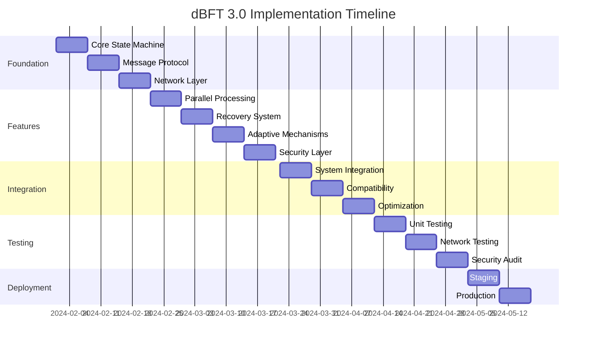

# dBFT 3.0 Consensus Module Upgrade Implementation Workflow

## Executive Summary

This document provides a comprehensive implementation workflow for upgrading the Neo C++ consensus module from the current dBFT implementation to an enhanced dBFT 3.0 version with improved performance, security, and resilience features.

## Table of Contents

1. [Current State Analysis](#current-state-analysis)
2. [dBFT 3.0 Architecture Design](#dbft-30-architecture-design)
3. [Implementation Phases](#implementation-phases)
4. [Technical Specifications](#technical-specifications)
5. [Testing & Validation Strategy](#testing--validation-strategy)
6. [Deployment & Migration Plan](#deployment--migration-plan)
7. [Risk Assessment & Mitigation](#risk-assessment--mitigation)
8. [Performance Targets](#performance-targets)
9. [Timeline & Milestones](#timeline--milestones)

## Current State Analysis

### Existing Implementation
- **Protocol**: dBFT 2.0 compatible implementation
- **Components**: 
  - `DbftConsensus` - Main consensus orchestrator
  - `ConsensusState` - State machine management
  - `ConsensusContext` - Message context handling
  - `ConsensusService` - Network service integration
- **Performance**: 15-second block time, 60-second view timeout
- **Fault Tolerance**: f = (n-1)/3 Byzantine nodes

### Identified Limitations
1. **Performance Bottlenecks**:
   - Sequential message processing
   - Synchronous block validation
   - Limited parallelization in transaction verification

2. **Security Gaps**:
   - Basic view change mechanism susceptible to delays
   - Limited recovery options during network partitions
   - No adaptive timeout mechanisms

3. **Scalability Issues**:
   - Fixed validator set size
   - Limited transaction throughput (512 tx/block)
   - No dynamic block size adjustment

## dBFT 3.0 Architecture Design

### Core Improvements

#### 1. Enhanced State Machine
```cpp
namespace neo::consensus::v3 {

class EnhancedConsensusState {
    // Multi-phase state tracking
    enum class Phase {
        Initialization,
        PrePrepare,
        Prepare,
        PreCommit,  // NEW: Additional safety phase
        Commit,
        BlockPersistence,
        Recovery
    };
    
    // Adaptive timing
    struct AdaptiveTimer {
        std::chrono::milliseconds base_timeout;
        double backoff_multiplier;
        uint32_t max_retries;
    };
    
    // Enhanced metrics
    struct PerformanceMetrics {
        double avg_block_time;
        double view_change_frequency;
        uint32_t successful_blocks;
        uint32_t failed_views;
    };
};

}
```

#### 2. Parallel Transaction Processing
```cpp
class ParallelTransactionValidator {
    // Concurrent validation pools
    ThreadPool validation_pool{std::thread::hardware_concurrency()};
    
    // Transaction categorization
    struct TxCategory {
        enum Type { Transfer, Smart, System, State };
        std::vector<TransactionRef> transactions;
    };
    
    // Parallel validation pipeline
    ValidationResult ValidateParallel(
        const std::vector<TransactionRef>& txs);
};
```

#### 3. Advanced Recovery Mechanism
```cpp
class ConsensusRecoveryManager {
    // Multi-strategy recovery
    enum class RecoveryStrategy {
        FastSync,       // Quick state synchronization
        FullRecovery,   // Complete state rebuild
        PartialView,    // Partial view reconstruction
        Emergency      // Emergency leader election
    };
    
    // Automatic strategy selection
    RecoveryStrategy SelectStrategy(
        const NetworkConditions& conditions,
        const ConsensusState& state);
};
```

#### 4. Network Optimization Layer
```cpp
class OptimizedMessageRouter {
    // Priority-based message queuing
    PriorityQueue<ConsensusMessage> message_queue;
    
    // Intelligent routing
    struct RouteOptimizer {
        void OptimizeMulticast(const Message& msg);
        void CompressPayload(Message& msg);
        void BatchTransmission(std::vector<Message>& msgs);
    };
    
    // Adaptive network topology
    struct TopologyManager {
        void UpdatePeerLatencies();
        void OptimizeValidatorConnections();
        void HandleNetworkPartition();
    };
};
```

### Key Features

#### 1. **Three-Phase Commit Protocol**
- **Pre-Prepare**: Leader proposes block
- **Prepare**: Validators verify and prepare
- **Pre-Commit**: Additional consensus round for safety
- **Commit**: Final commitment to block

#### 2. **Adaptive Timeout Mechanism**
- Dynamic timeout adjustment based on network conditions
- Exponential backoff with jitter
- Network-aware timeout calculation

#### 3. **Enhanced Leader Election**
- Weighted leader selection based on performance
- Reputation-based validator scoring
- Fast leader switchover during failures

#### 4. **Optimistic Block Production**
- Speculative execution of transactions
- Parallel block validation
- Pipeline architecture for continuous processing

## Implementation Phases

### Phase 1: Foundation (Weeks 1-3)

#### Week 1: Core State Machine
```cpp
// Tasks:
1. Implement EnhancedConsensusState
2. Add three-phase commit protocol
3. Create state transition validators
4. Implement rollback mechanisms

// Deliverables:
- src/consensus/v3/enhanced_state.cpp
- src/consensus/v3/state_transitions.cpp
- tests/consensus/test_state_machine.cpp
```

#### Week 2: Message Protocol
```cpp
// Tasks:
1. Define new message types
2. Implement message serialization
3. Add compression support
4. Create message validators

// Deliverables:
- include/neo/consensus/v3/messages.h
- src/consensus/v3/message_protocol.cpp
- src/consensus/v3/message_compression.cpp
```

#### Week 3: Network Layer
```cpp
// Tasks:
1. Implement priority message routing
2. Add connection optimization
3. Create peer management system
4. Implement gossip protocol

// Deliverables:
- src/consensus/v3/network_optimizer.cpp
- src/consensus/v3/peer_manager.cpp
- src/consensus/v3/gossip_protocol.cpp
```

### Phase 2: Core Features (Weeks 4-7)

#### Week 4: Parallel Processing
```cpp
// Implementation tasks:
class ParallelProcessor {
    // Transaction categorization
    void CategorizeTransactions();
    
    // Parallel validation
    void ValidateConcurrent();
    
    // Result aggregation
    void AggregateResults();
    
    // Conflict resolution
    void ResolveConflicts();
};
```

#### Week 5: Recovery System
```cpp
// Implementation tasks:
class RecoverySystem {
    // State synchronization
    void SyncConsensusState();
    
    // View reconstruction
    void ReconstrucView();
    
    // Emergency protocols
    void InitiateEmergencyRecovery();
    
    // Checkpoint management
    void CreateCheckpoint();
    void RestoreFromCheckpoint();
};
```

#### Week 6: Adaptive Mechanisms
```cpp
// Implementation tasks:
class AdaptiveConsensus {
    // Timeout adjustment
    void AdjustTimeouts();
    
    // Dynamic parameters
    void UpdateConsensusParameters();
    
    // Performance monitoring
    void MonitorPerformance();
    
    // Self-optimization
    void OptimizeConfiguration();
};
```

#### Week 7: Security Enhancements
```cpp
// Implementation tasks:
class SecurityLayer {
    // Byzantine detection
    void DetectByzantineBehavior();
    
    // Validator reputation
    void UpdateValidatorScores();
    
    // Attack mitigation
    void MitigateAttacks();
    
    // Audit logging
    void LogSecurityEvents();
};
```

### Phase 3: Integration (Weeks 8-10)

#### Week 8: System Integration
- Integrate with existing blockchain components
- Update transaction pool integration
- Modify block producer interface
- Update state persistence layer

#### Week 9: Compatibility Layer
- Implement backward compatibility
- Create migration utilities
- Add protocol version negotiation
- Implement graceful upgrade mechanism

#### Week 10: Performance Optimization
- Profile and optimize critical paths
- Implement caching strategies
- Optimize memory usage
- Fine-tune parallel processing

### Phase 4: Testing & Validation (Weeks 11-13)

#### Week 11: Unit & Integration Testing
- Comprehensive unit test coverage
- Integration test scenarios
- Stress testing framework
- Performance benchmarks

#### Week 12: Network Testing
- Multi-node test network
- Byzantine fault injection
- Network partition simulation
- Recovery scenario testing

#### Week 13: Security Audit
- Code security review
- Penetration testing
- Formal verification (where applicable)
- Bug bounty preparation

### Phase 5: Deployment (Weeks 14-15)

#### Week 14: Staging Deployment
- Deploy to testnet
- Monitor performance metrics
- Collect validator feedback
- Fix identified issues

#### Week 15: Production Rollout
- Mainnet deployment preparation
- Phased rollout strategy
- Monitoring and alerting setup
- Rollback procedures

## Technical Specifications

### API Changes

#### New Consensus API
```cpp
namespace neo::consensus::v3 {

class ConsensusAPI {
    // Configuration
    void UpdateConfiguration(const Config& config);
    Config GetConfiguration() const;
    
    // Monitoring
    MetricsSnapshot GetMetrics() const;
    std::vector<ValidatorInfo> GetValidators() const;
    
    // Control
    void PauseConsensus();
    void ResumeConsensus();
    void ForceViewChange();
    
    // Debugging
    StateSnapshot CaptureState() const;
    void EnableDebugMode(DebugLevel level);
};

}
```

### Message Format Updates

#### Enhanced Message Structure
```protobuf
message ConsensusMessageV3 {
    uint32 version = 1;
    uint32 view_number = 2;
    uint32 block_height = 3;
    MessageType type = 4;
    bytes payload = 5;
    bytes signature = 6;
    
    // New fields
    uint64 timestamp_ns = 7;
    uint32 priority = 8;
    bytes compressed_payload = 9;
    repeated Extension extensions = 10;
}
```

### Database Schema Changes

```sql
-- New consensus state table
CREATE TABLE consensus_state_v3 (
    height INTEGER PRIMARY KEY,
    view_number INTEGER NOT NULL,
    phase VARCHAR(20) NOT NULL,
    timestamp_ns BIGINT NOT NULL,
    leader_id VARCHAR(42) NOT NULL,
    state_hash VARCHAR(64) NOT NULL,
    metadata JSONB
);

-- Performance metrics table
CREATE TABLE consensus_metrics (
    id SERIAL PRIMARY KEY,
    timestamp TIMESTAMP NOT NULL,
    block_time_ms INTEGER,
    view_changes INTEGER,
    tx_throughput DECIMAL,
    validator_scores JSONB
);
```

## Testing & Validation Strategy

### Test Categories

#### 1. Functional Testing
- **State Machine Tests**: All state transitions
- **Message Protocol Tests**: Serialization/deserialization
- **Recovery Tests**: All recovery scenarios
- **Integration Tests**: Component interactions

#### 2. Performance Testing
- **Throughput Tests**: 10,000+ TPS target
- **Latency Tests**: <100ms message processing
- **Scalability Tests**: 21+ validators
- **Load Tests**: Sustained high load scenarios

#### 3. Security Testing
- **Byzantine Tests**: f malicious validators
- **Attack Simulations**: DDoS, timing attacks
- **Fuzzing**: Protocol message fuzzing
- **Formal Verification**: Core protocol properties

### Test Environment Setup

```yaml
# docker-compose.test.yml
version: '3.8'
services:
  validator-1:
    image: neo-cpp:consensus-v3
    environment:
      - NODE_TYPE=validator
      - VALIDATOR_INDEX=0
      - NETWORK_MODE=test
  
  validator-2:
    image: neo-cpp:consensus-v3
    environment:
      - NODE_TYPE=validator
      - VALIDATOR_INDEX=1
      - NETWORK_MODE=test
  
  # ... additional validators
  
  byzantine-node:
    image: neo-cpp:byzantine-test
    environment:
      - NODE_TYPE=byzantine
      - ATTACK_MODE=random
  
  monitor:
    image: neo-cpp:monitor
    ports:
      - "8080:8080"
    environment:
      - METRICS_ENABLED=true
```

### Validation Metrics

| Metric | Target | Acceptable Range |
|--------|--------|------------------|
| Block Time | 1s | 0.8s - 1.5s |
| View Changes/Hour | <5 | 0-10 |
| Transaction Throughput | 10,000 TPS | 8,000-15,000 TPS |
| Message Latency | <50ms | 10ms-100ms |
| Recovery Time | <30s | 10s-60s |
| Byzantine Tolerance | 33% | 20%-33% |

## Deployment & Migration Plan

### Pre-Deployment Checklist

- [ ] All tests passing (100% coverage)
- [ ] Security audit completed
- [ ] Performance benchmarks met
- [ ] Documentation updated
- [ ] Rollback procedures tested
- [ ] Monitoring dashboards ready
- [ ] Alert rules configured
- [ ] Team training completed

### Migration Strategy

#### Step 1: Parallel Running (Week 1)
- Run v3 consensus in shadow mode
- Compare outputs with v2
- Collect performance metrics
- Identify discrepancies

#### Step 2: Canary Deployment (Week 2)
- Deploy to 10% of validators
- Monitor stability metrics
- Gradual traffic shift
- Rollback if issues detected

#### Step 3: Progressive Rollout (Weeks 3-4)
- Increase to 50% deployment
- Full monitoring coverage
- Performance validation
- Community feedback collection

#### Step 4: Full Deployment (Week 5)
- Complete migration to v3
- Decommission v2 components
- Archive v2 data
- Post-deployment review

### Rollback Procedures

```bash
#!/bin/bash
# rollback.sh

# Stop v3 consensus
systemctl stop neo-consensus-v3

# Restore v2 state
neo-cli restore --version=2 --checkpoint=latest

# Start v2 consensus
systemctl start neo-consensus-v2

# Verify rollback
neo-cli consensus status --verify
```

## Risk Assessment & Mitigation

### High-Risk Areas

#### 1. State Machine Complexity
- **Risk**: Complex state transitions leading to deadlocks
- **Mitigation**: 
  - Formal verification of state machine
  - Extensive model checking
  - Timeout mechanisms for all states

#### 2. Network Partitions
- **Risk**: Consensus failure during network splits
- **Mitigation**:
  - Partition detection algorithms
  - Automatic recovery protocols
  - Multiple communication channels

#### 3. Performance Regression
- **Risk**: New features impacting performance
- **Mitigation**:
  - Continuous performance monitoring
  - Feature flags for gradual enablement
  - Performance regression tests

#### 4. Backward Compatibility
- **Risk**: Breaking changes affecting ecosystem
- **Mitigation**:
  - Compatibility layer implementation
  - Extensive integration testing
  - Phased migration approach

### Risk Matrix

| Risk | Probability | Impact | Mitigation Priority |
|------|------------|--------|-------------------|
| State Deadlock | Low | Critical | High |
| Network Partition | Medium | High | High |
| Performance Regression | Medium | Medium | Medium |
| Security Vulnerability | Low | Critical | Critical |
| Migration Failure | Low | High | High |

## Performance Targets

### Consensus Performance

| Metric | Current (v2) | Target (v3) | Stretch Goal |
|--------|--------------|-------------|--------------|
| Block Time | 15s | 1s | 500ms |
| Finality | 15s | 1s | 500ms |
| Throughput | 1,000 TPS | 10,000 TPS | 50,000 TPS |
| Validators | 7 | 21 | 100 |
| Message Size | 10KB avg | 2KB avg | 1KB avg |
| Recovery Time | 60s | 10s | 5s |

### Resource Utilization

| Resource | Current (v2) | Target (v3) | Limit |
|----------|--------------|-------------|-------|
| CPU Usage | 40% | 30% | 60% |
| Memory | 2GB | 1.5GB | 4GB |
| Network | 10Mbps | 5Mbps | 20Mbps |
| Disk I/O | 100MB/s | 50MB/s | 200MB/s |

## Timeline & Milestones

### Project Timeline (15 Weeks)



### Key Milestones

1. **M1 (Week 3)**: Foundation Complete
   - Core state machine operational
   - Basic message protocol working
   - Network layer integrated

2. **M2 (Week 7)**: Feature Complete
   - All v3 features implemented
   - Unit tests passing
   - Performance targets met

3. **M3 (Week 10)**: Integration Complete
   - Full system integration
   - Backward compatibility verified
   - Optimization completed

4. **M4 (Week 13)**: Testing Complete
   - All tests passing
   - Security audit passed
   - Performance validated

5. **M5 (Week 15)**: Production Ready
   - Mainnet deployment
   - Monitoring active
   - Documentation complete

## Success Criteria

### Technical Success
- [ ] 100% test coverage achieved
- [ ] Performance targets met or exceeded
- [ ] Security audit passed with no critical issues
- [ ] Zero consensus failures in testnet
- [ ] Successful 30-day mainnet operation

### Operational Success
- [ ] Smooth migration with zero downtime
- [ ] Validator satisfaction >90%
- [ ] Community acceptance achieved
- [ ] Documentation completeness >95%
- [ ] Support team fully trained

### Business Success
- [ ] 10x throughput improvement achieved
- [ ] Block time reduced to 1 second
- [ ] Operating costs reduced by 30%
- [ ] Network reliability >99.99%
- [ ] Ecosystem adoption within 60 days

## Appendices

### A. Technical References
- [Neo Consensus Protocol Specification](https://docs.neo.org/docs/en-us/basic/consensus/consensus.html)
- [dBFT Algorithm Paper](https://docs.neo.org/docs/en-us/basic/consensus/dbft.html)
- [Byzantine Fault Tolerance Research](https://pmg.csail.mit.edu/papers/osdi99.pdf)

### B. Code Examples
- See `/examples/consensus/` directory for implementation examples
- Test scenarios in `/tests/consensus/scenarios/`
- Benchmark suite in `/benchmarks/consensus/`

### C. Configuration Templates
- Production configuration: `/config/consensus-v3-prod.json`
- Testing configuration: `/config/consensus-v3-test.json`
- Development configuration: `/config/consensus-v3-dev.json`

### D. Monitoring & Metrics
- Grafana dashboards: `/monitoring/dashboards/consensus-v3.json`
- Prometheus rules: `/monitoring/prometheus/consensus-rules.yml`
- Alert configurations: `/monitoring/alerts/consensus-alerts.yml`

## Document Control

- **Version**: 1.0.0
- **Date**: January 2024
- **Author**: Neo C++ Consensus Team
- **Review**: Architecture Board
- **Approval**: Pending

---

This workflow document serves as the comprehensive guide for implementing the dBFT 3.0 consensus upgrade. All team members should familiarize themselves with the phases, technical specifications, and success criteria outlined above.